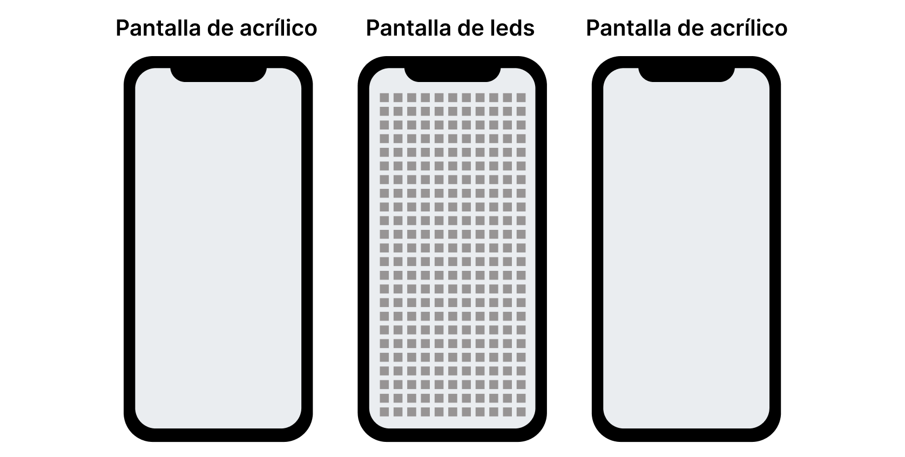
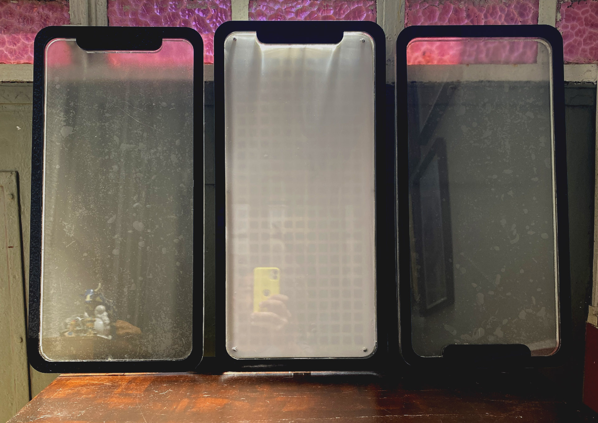
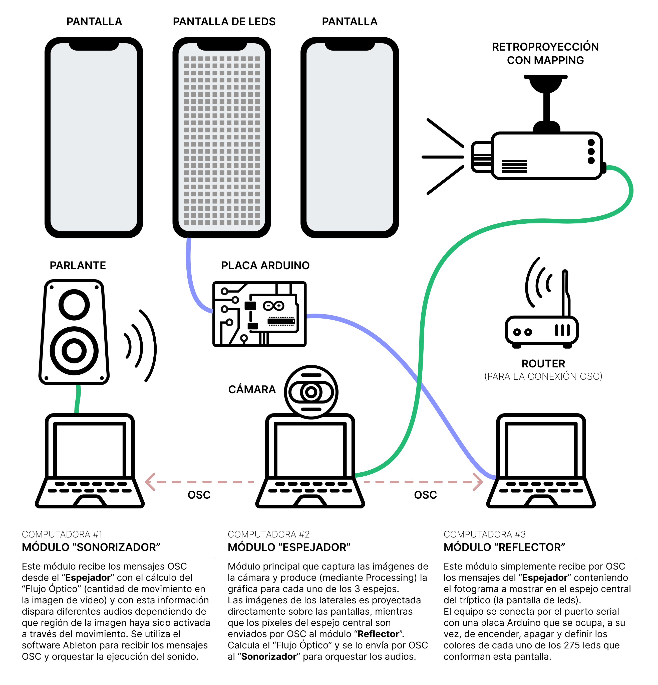
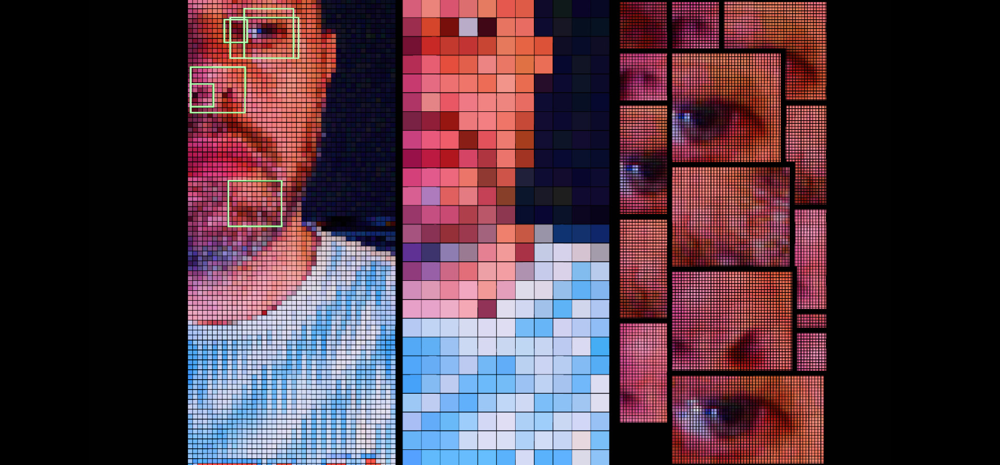
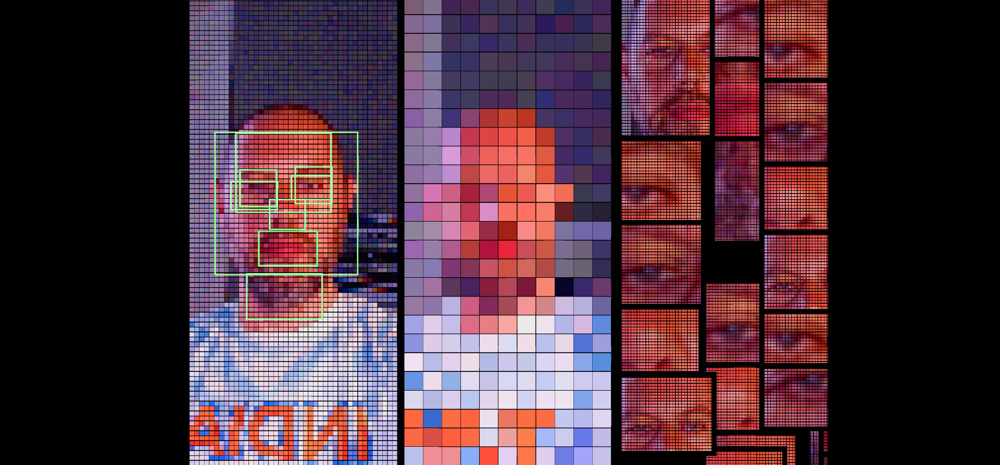

# Fractura expuesta. Devenires digitales fragmentados
> Proyecto final para la materia "Programación de Entornos Sensoriales" - MAE - UNTREF / Autores: Gastón Martino y Diego Flores

# Introducción
En su artículo La doble vida del hipersujeto, Leonardo Solaas habla sobre la naturaleza fragmentaria y discontinua del *stream* (ese flujo de información que consumimos diariamente en las plataformas mediante el *scrolling*), donde cada publicación es independiente y separada de las demás, aunque conectadas entre sí por el oscuro y arbitrario mandato de los algoritmos.

Mediante un conjunto de tres pantallas de acrílico de gran escala (los “espejos”), este trabajo busca señalar el rol de las corporaciones y los Estados en la fragmentación y la disolución de las identidades individuales y el abrumador alcance panóptico de los centros de poder que, mediante nuevas prácticas extractivistas, segmentan, clasifican y monitorean a sus usuarios, reducidos a innumerables conjuntos discretos de datos.

# Los Espejos Transformantes
Las identidades individuales en el mundo digital discurren (y se diluyen) en el incesante fluir de los *streams* de nuestros dispositivos. La atención se vuelve cada vez más fragmentada mientras que las corporaciones no cesan de clasificar, segmentar a sus usuarios gracias a la descomunal cantidad de información sustraída a diario (no siempre de manera voluntaria) desde nuestros dispositivos personales.

En este proyecto, los espejos transformantes son las propias pantallas de los dispositivos cotidianos que reflejan identidades fragmentadas, una compulsión desmedida por la segmentación y la reducción de los sujetos a datos numéricos disponibles para ser procesados y fraccionados.

El trabajo realizado para este proyecto es una continuación de la investigación realizada para la obra *Rebelión en la granja de clics*, como trabajo de cierre del primer año de la maestría. Tres de las pantallas construidas para la muestra se convierten ahora en un espejo tríptico que transforma el reflejo del usuario captado por la cámara, aplicando operaciones de fragmentación, clasificación y segmentación de las imágenes de video.

> El tríptico de “espejos transformantes” conformado por tres pantallas de acrílico de 25cm x 50cm. La del medio está armada con leds y las otras dos son usadas para proyectar las imágenes generadas.

En el centro del tríptico, la pantalla está construida con 275 leds (11 columnas de 25 leds cada una). La imagen capturada por la webcam es interpretada por Processing para reducirla a una matriz de 275 píxeles y enviada (por el puerto serial) a una placa Arduino que enciende y apaga los leds correspondientes, produciendo el efecto de “fragmentación” de la imagen original.
Los laterales del tríptico son dos pantallas de acrílico donde se proyectan imágenes también generadas programáticamente desde Processing a partir de la captura de video de la webcam.

## Software utilizado
- **Processing** es usado para procesar las imágenes capturadas por la cámara. Se utilizan las funciones de la librería de OpenCV para analizar las imágenes del video.
- **Ableton** es usado para recibir por OSC los mensajes de Processing que contienen el cálculo del “Flujo Óptico” y para orquestar la reproducción del sonido correspondiente.
- **Resolume+Spout** (opcional) es usado para mapear la gráfica generada desde Processing en las pantallas laterales del “espejo tríptico”.
- La comunicación entre las computadoras es por **OSC** y la comunicación con Arduino es a través del puerto serial.

# Arquitectura del proyecto
El siguiente diagrama muestra los equipos y dispositivos que componen la arquitectura básica del proyecto y la forma en que cada uno se comunica o conecta con los restantes.

En este diagrama se puede ver que se requieren dos equipos/computadoras para realizar las operaciones principales:
- **Espejador**: se ocupa del procesamiento del video y la generación de los gráficos
- **Sonorizador**: se encarga de orquestar el audio a partir de “Flujo Óptico” que recibe del módulo “Espejador” mediante mensajes OSC.

Alternativamente, se puede realizar la instalación del proyecto añadiendo un equipo más (el “Reflector”) que permita aliviar la carga del módulo principal del “Espejador”.

En este tercer equipo (el módulo “Reflector”) simplemente se ocupa de controlar la pantalla de leds (el espejo central). La información le es enviada desde el “Espejador” vía mensajes OSC.

# La Imagen en los Espejos
El equipo central (el módulo “Espejador”) es el encargado de procesar las imágenes capturadas por la cámara utilizando la librería de video de Processing y la librería de OpenCV para el análisis de las imágenes. Como resultado, genera 3 vistas que corresponden a cada uno de los espejos del tríptico. Estas vistas realizan las siguientes operaciones:
- **Fragmentación** (centro): convierte la imagen en una matriz de 11x25 píxeles para mostrar en la pantalla de leds. La operación se realiza por código sin usar OpenCV.
- **Fraccionamiento** (izq): analiza la imagen con las funciones de Face Recognition de OpenCV para detectar fragmentos de la cara y fraccionar la imagen en rectángulos.
- **Fractura** (der): cada uno de los rectángulos resultantes del fraccionamiento es mostrado en esta vista de forma fracturada y reiterada, en la forma de un mosaico.

